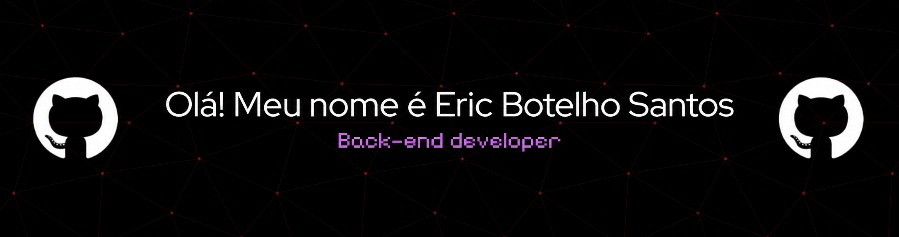

<div align="center">



<br>

<a href="https://git.io/typing-svg">
  
</a>

<br><br>

<a href="https://github.com/EricBotelhoSantos">
  
</a>

</div>

<br>

<!-- ABOUT ME -->

##  &nbsp;About Me


```yaml
name: Eric Botelho Santos
located_in: Fortaleza, CE - Brasil 🇧🇷
education: Análise e Desenvolvimento de Sistemas @ Unifametro

fields_of_interest:
  - Web Development
  - Software Engineering
  - Problem Solving

currently_learning:
  - React & Next.js
  - Java & Spring Boot

hobbies:
  - Coding 💻
  - Innovation 🚀
  - Technology 🔧
```

<br clear="both">

---

<!-- TECH STACK -->

## 🛠️ &nbsp;Tech Stack

<div align="center">

### 💻 &nbsp;Languages


<br><br>

### ⚡ &nbsp;Frameworks & Libraries


<br><br>

### 🗄️ &nbsp;Databases


<br><br>

### 🔧 &nbsp;Tools


</div>

<br>

---

<!-- GITHUB STATS -->

## 📊 &nbsp;GitHub Analytics

<div align="center">





</div>

<br>

<div align="center">


</div>

<br>

<!-- ACTIVITY GRAPH -->

<div align="center">



</div>

<br>

<!-- SNAKE ANIMATION -->

<div align="center">

<picture>
  <source media="(prefers-color-scheme: dark)" srcset="https://raw.githubusercontent.com/EricBotelhoSantos/EricBotelhoSantos/output/github-contribution-grid-snake-dark.svg">
  <source media="(prefers-color-scheme: light)" srcset="https://raw.githubusercontent.com/EricBotelhoSantos/EricBotelhoSantos/output/github-contribution-grid-snake.svg">
  
</picture>

</div>

<br>

---

<!-- CONTACT -->

## 📬 &nbsp;Connect with me

<div align="center">

<a href="mailto:dev.ericbotelho@gmail.com">
  
</a>

<a href="https://www.linkedin.com/in/ericbotelhosantos/">
  
</a>

<a href="https://www.instagram.com/eric.xz_/">
  
</a>

</div>

<br><br>

<div align="center">


</div>
