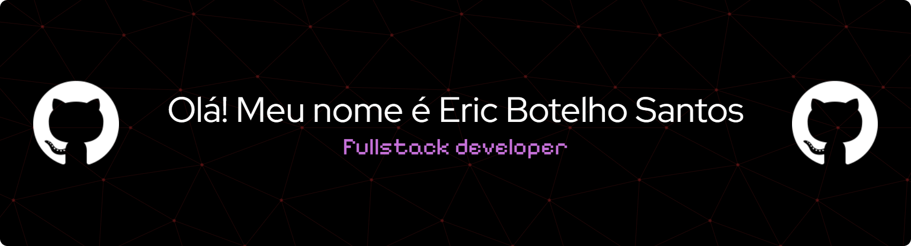

  

###

Estudante de Análise e Desenvolvimento de Sistemas na Faculdade Unifametro em Fortaleza. Minha verdadeira paixão sempre esteve em inovar, criar e resolver desafios com o poder da computação. Por isso, meu foco profissional agora é aplicar toda a minha energia e dedicação para inovar e gerar resultados na área de tecnologia.

  
  

###

###

  
  
  
  
  
  
  
  
  
  
  
  
  
  
  
  
  

###

  
  
  

###

 

###

<picture align="center">
  <source media="(prefers-color-scheme: dark)" srcset="https://raw.githubusercontent.com/EricBotelhoSantos/EricBotelhoSantos/output/github-contribution-grid-snake-dark.svg">
  <source media="(prefers-color-scheme: light)" srcset="https://raw.githubusercontent.com/EricBotelhoSantos/EricBotelhoSantos/output/github-contribution-grid-snake-dark.svg">
  
</picture>
